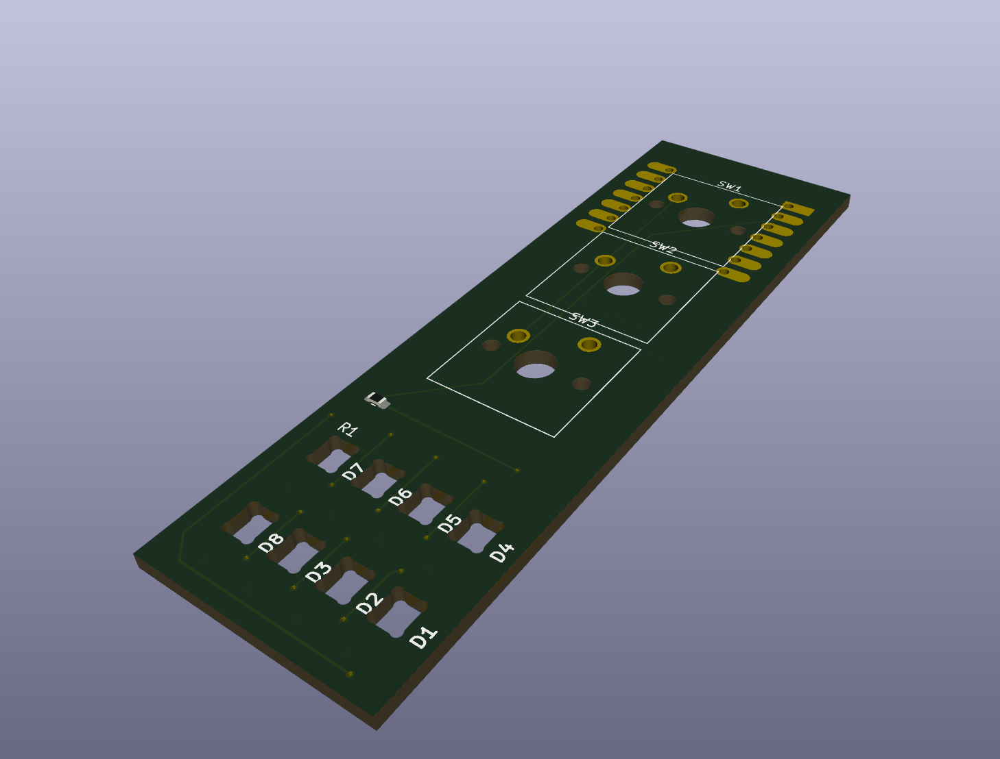
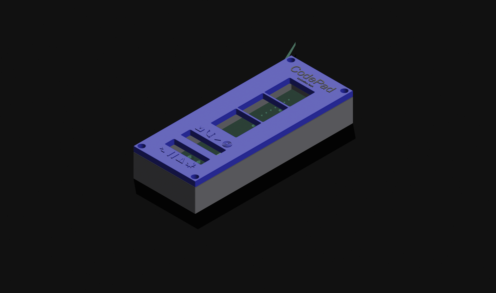

CodePad is a small 3-key macropad for coding. It integrates with Visual Studio Code to show things such as git commit status, unsaved files, bugs, and more. The keys change depending on the program, but for now they are Save, Save All, and git commit (will AI-generate a commit message).
BOM:
|Reference|Qty|Value|DNP|Exclude from BOM|Exclude from Board|Footprint|Datasheet|
|---|---|---|---|---|---|---|---|
|D1,D2,D3,D4,D5,D6,D7,D8|8|SK6812MINI-E||||footprints:SK6812MINI-E_fixed|https://cdn-shop.adafruit.com/product-files/4960/4960_SK6812MINI-E_REV02_EN.pdf|
|R1|1|330R||||Resistor_SMD:R_0603_1608Metric|~|
|SW1,SW2,SW3|3|SW_Push||||Button_Switch_Keyboard:SW_Cherry_MX_1.00u_PCB|~|
|U1|1|MOUDLE-SEEEDUINO-XIAO||||footprints:XIAO-Generic-Hybrid-14P-2.54-21X17.8MM||

Firmware is written in circuitpython.

---
AI declaration: I have used AI for commit messages to this repo, this is the only AI use in this project.